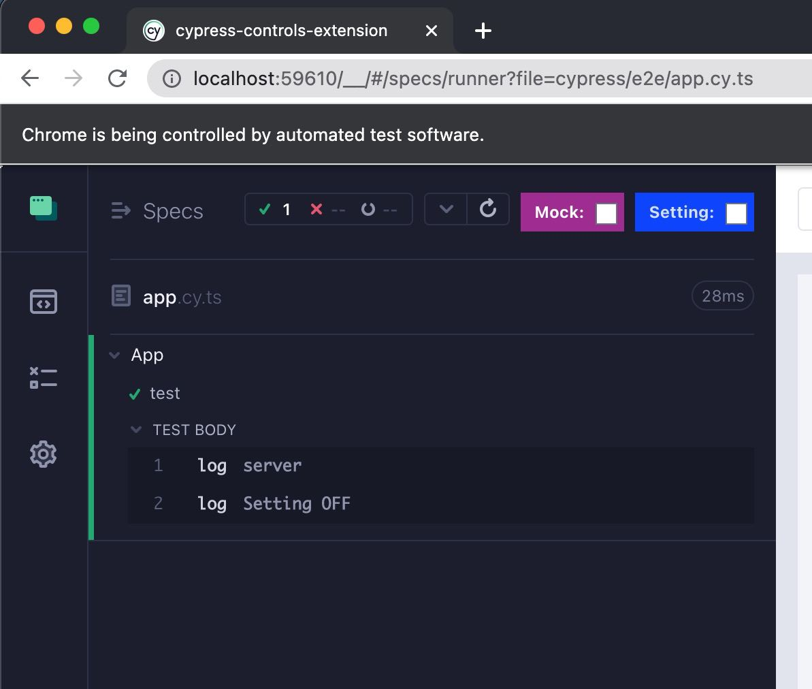
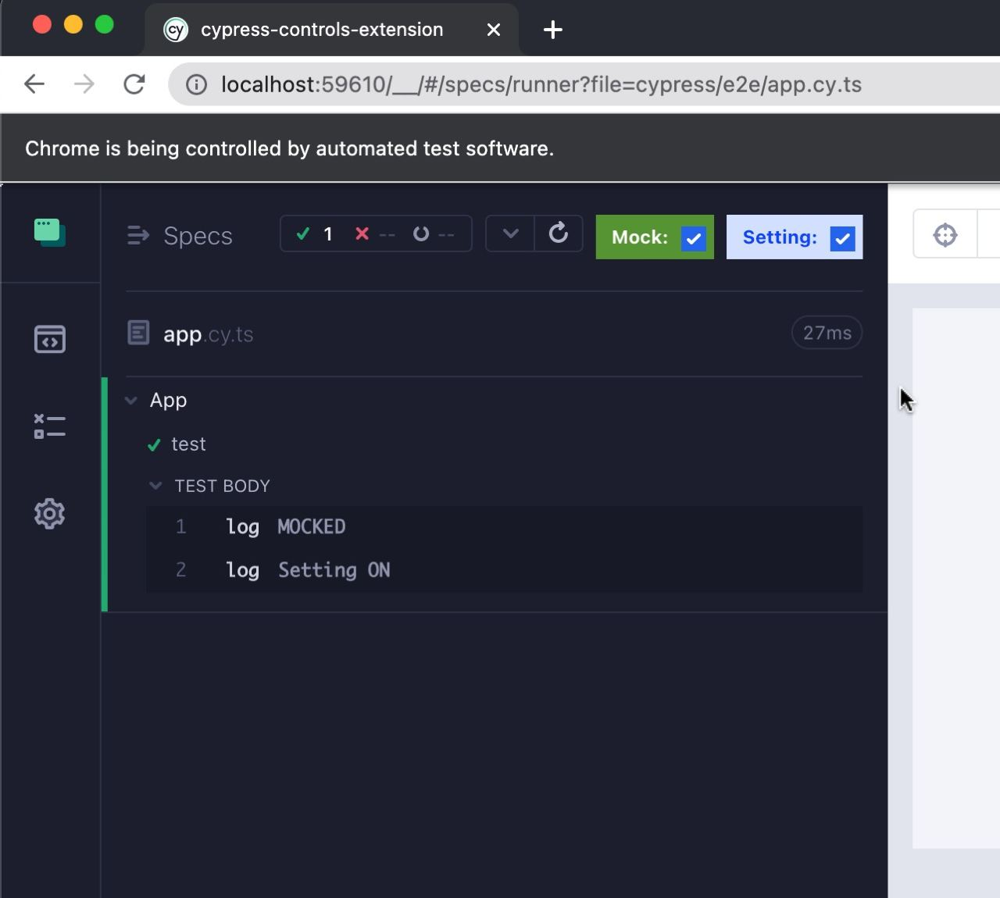

# cypress-controls-extension

Extension to embed controls to cypress app

Can have event listeners and style style

// under construction

Setups
 - create control - object of type SetupControlSettings
 - register before tests by `setupControlsExtensionWithEvent([myButton]);` in support/index.js or corresponding place